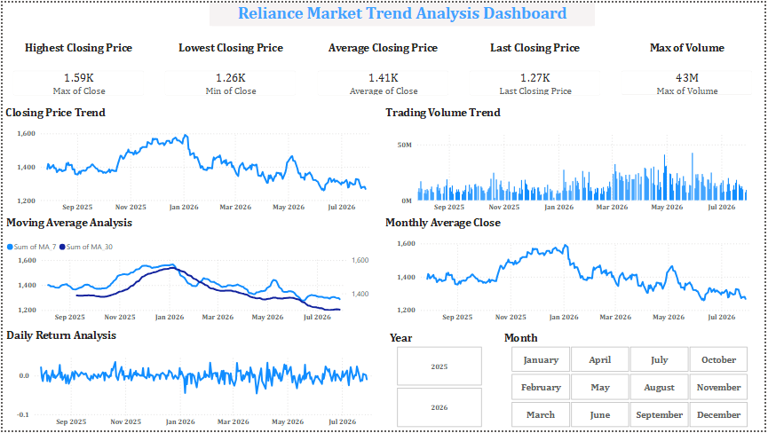

# 📈 Reliance Market Trend Analysis

A data analysis project that explores Reliance Industries stock market trends using Python and Power BI.

---

## 📌 Project Overview

This project analyzes Reliance stock market data to identify trends, trading volume, moving averages, and daily returns.

The dashboard was built using Power BI, while Python was used for data cleaning and preprocessing.

---

## 📊 Dashboard Preview

---

## 🛠️ Tools & Technologies

- Python
- Pandas
- NumPy
- Jupyter Notebook
- Power BI
- CSV Dataset

---

## 📊 Dashboard Features

- Highest Closing Price
- Lowest Closing Price
- Average Closing Price
- Last Closing Price
- Trading Volume Trend
- Closing Price Trend
- Moving Average Analysis (MA7 & MA30)
- Monthly Average Closing Price
- Daily Return Analysis
- Year and Month Slicers

---

## 📁 Project Files

- Reliance_Market_Trend_Analysis.ipynb
- Reliance_Market_Trend_Analysis.pbix
- row_data.csv
- dashboard.png

---

## 📷 Dashboard Preview

---

## 📈 Key Insights

- Closing prices reached their highest around late 2025.
- Trading volume increased significantly during 2026.
- MA7 reacts faster than MA30, showing short-term market movement.
- Daily returns indicate regular market volatility.
- Monthly average closing prices show changing market trends over time.

---

## 🚀 Future Improvements

- Add Bollinger Bands
- Add RSI Indicator
- Forecast future stock prices
- Compare multiple company stocks

---

## 👨‍💻 Author

**Pushpendra Yadav**

B.Tech CSE (Data Science)

Learning Data Analytics | Python | SQL | Power BI
